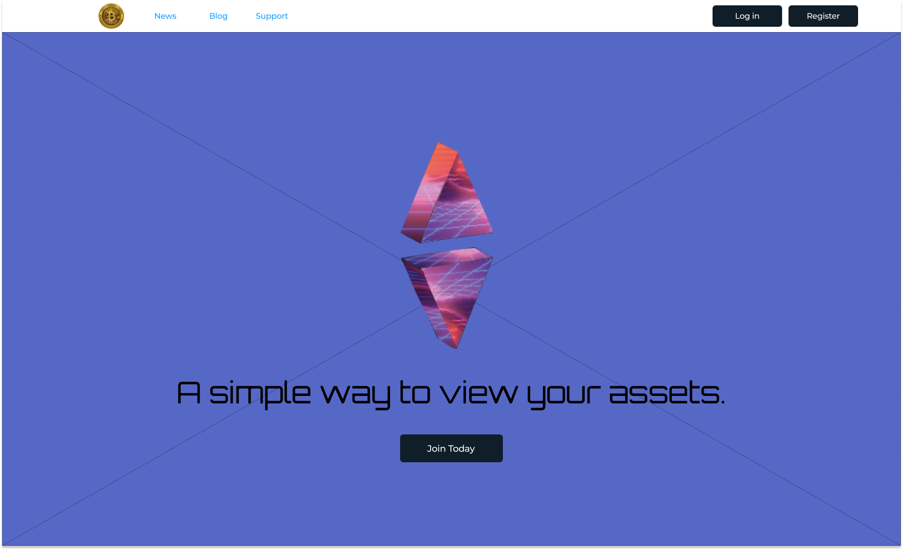
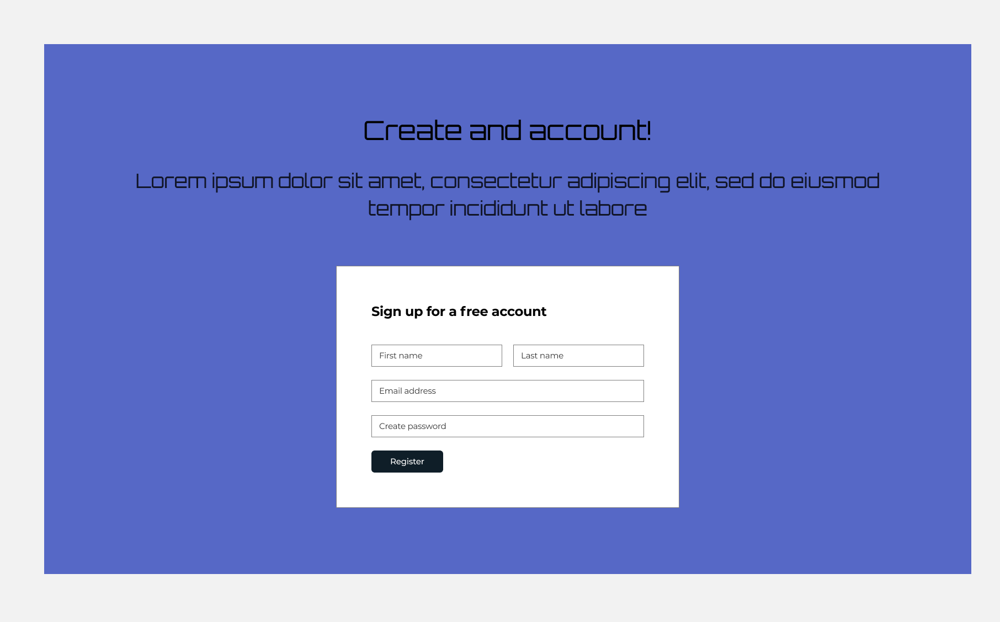
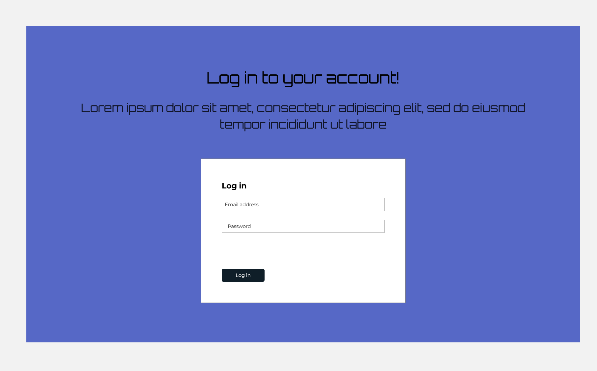
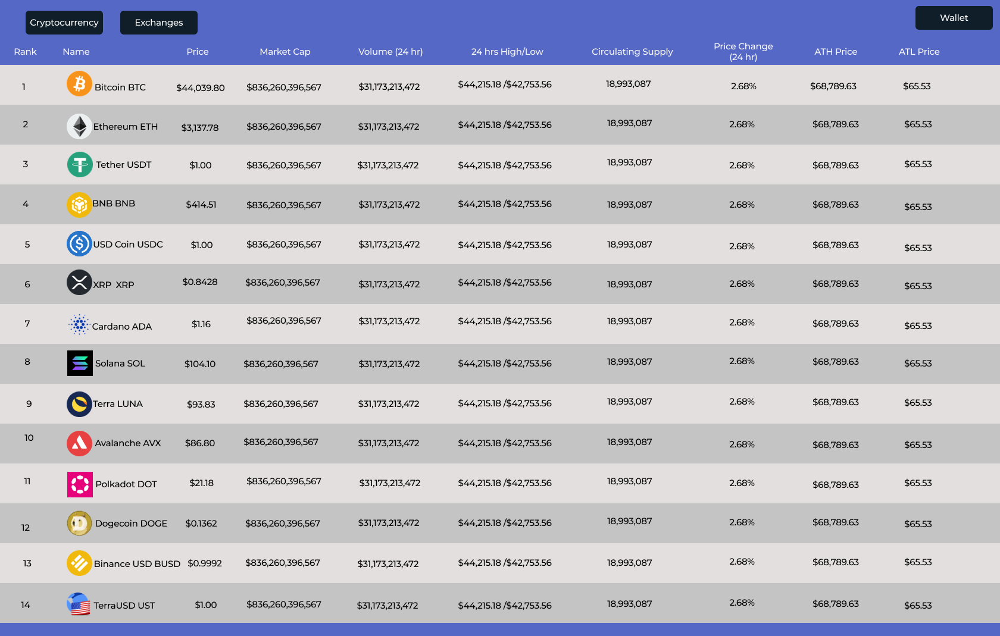

The content below is an example project proposal / requirements document. Replace the text below the lines marked "__TODO__" with details specific to your project. Remove the "TODO" lines.

(Project name: SatoshiViewer)

# Sanchit Kumar

## Overview

SatoshiViewer will be a MERN stack based crypto and traditional portfolio tracking application. This application will make use of Coinmarketcap’s python API to source the data (https://coinmarketcap.com/api/documentation/v1/#section/Introduction) , and I will be using reference code from “Cryptoverse” for the workflows as well as the screen layout design (https://reactjsexample.com/cryptoverse-a-crypto-tracking-app-made-with-reactjs-nodejs-ejs-vanilla-js-and-axios-cheerio/).

 This application using react as the front end, will allow for a very intuitive and real time view of crypto exposure and portfolio analytics. The portfolio components of the user will be stored within mongodb as will be user preferences and the screen layouts. This application will be deployed on Heroku, and will be able to be used on both your desktop and mobile device in order to give a multichannel experience. Lastly, this application’s url will be able to be changed to a custom URL nginx.   


## Data Model
 

The application will store Users information ( wallets , preferences ) as well as
* users can have multiple portfolios (via references)
* each portfolio can have multiple portfolioComponents (by embedding)

An Example Wallet:

```javascript
{
  userSchema: // list of user wallets
}
```

An Example UserSchema:

```javascript
{
  username: "cryptotrader",
  password: // a password hash,
  address: //hashed wallet address
  portfolios: // an array of references to PortfolioComponent documents
}
```

An Example Portfolio with Embedded PortfolioComponents:

```javascript
{
  address: // a reference to a UserSchema object
  name: "Crypto Portfolio",
  components: [
    { coin: "ETH", quantity: "9876"},
    { name: "BTC", quantity: "2"},
  ],
  createdAt: // timestamp
}
```


## [Link to Commented First Draft Schema](db.js) 

## Wireframes

/ - Homescreen view 



/signup - page for creating account



/login - page for logging in to your account



/coinview - page for looking at coin and securites prices 



## Site map

Here's the [Sitemap](documentation/Satoshi-Viewer-Sitemap.png)

## User Stories or Use Cases

1. as non-registered user, I can register a new account with the site
2. as a user, I can log in to the site
3. as a user, I can add a Wallet  
4. as a user, I can create a Portfolio
5. as a user, I can add Portfolio Components to a Portfolio


## Research Topics

* (5 points) Incorporating ReactJS
    * Will be using ReactJS for all the front end work 
    * Will need to research MVC template and how to use a React frontend with an express
      backend. 
* (3 points) Unit testing with JavaScript
    * using Mocha and Chai I will create unit test in "test/projectTest.js"
    * Will include at least 4 unit tests
* (3 points) Incorporating Coinmarketcaps's API 
    * Will need to research how to intergrate a python API with an express backend.
    * This API will allow me to get real time coin data that will populate the users
      portfolio and coin view.
* (3 points) Incorporating Web3 wallet connect. 
    * Essentially will allow connectio to metamask and other wallets so users can access 
      their wallets from the website. 


## [Link to Initial Main Project File](app.js) 


## Annotations / References Used


1. [db.js Schema notes](https://blog.murewaashiru.com/getting-started-with-mongodb-transactions-using-nodejs) 
2. [General idea for coin viewer wireframe](https://reactjsexample.com/cryptoverse-a-crypto-tracking-app-made-with-reactjs-nodejs-ejs-vanilla-js-and-axios-cheerio/)

